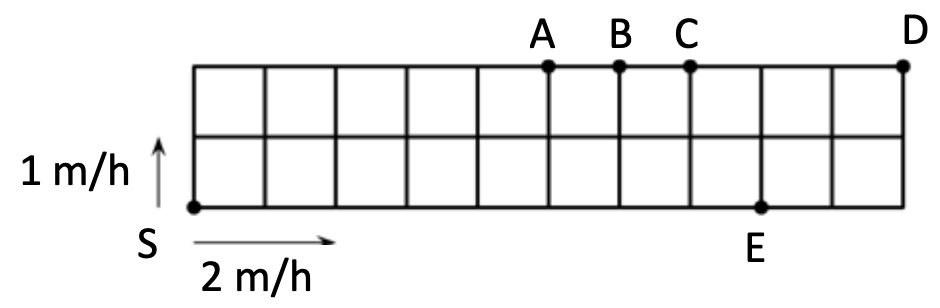

# Rate

## The Concept
The rate is defined the total value divided by the quantities. For example,
*	Speed = distance / time
*	Price = Money spent / quantities purchased
*	Productivity = work done / # of ppl / time

Conversely, knowing the rate, you can calculate the other quantities:
*	Distance = Speed * time, or Time = Distance / Speed
*	Money spent = Quantities purchased * Price, or Purchased = Spent / Price
*	Work done = Productivity * # of people * Time

While it is tempting to memorize the formula, there is really no need. Try to think in terms of how multiplication and division is defined. The rate is essentially the unit quantity. For example, speed, as the unit quantity, is defined as the number of miles one travels per hour (or number of meters in minutes). So, in this context, time simply defines the number of such "speed" units, and the distance is the total quantities. So, by definition of multiplication, speed multiplied by time gives the distance. Or by definition of division, divide the distance travelled by the time it takes gives the distance travelled in unit time, or Speed. Try to see this in the problem #1, and always refer back to this problem when you are not sure. The same is true for other types of quantities. 

## Questions

1. A train is traveling at 200 miles per hour. How much time does it take for the train to travel 600 miles? 

2. Tommy and Sammy live in two cities 16 miles apart. On Sunday, they decide to take off at the same time to meet in the middle. Tommy will walk to the meeting at 2 miles per hour, while Sammy will bike at 6 miles per hour. How many hours does it take for them to meet each other? And how far would Tommy have walked from start to meeting?

3.	A garden is divided into identical squares. A fast snail and a slow snail move along the perimeter of the garden starting simultaneously from the corner S but in different directions. The slow snail moves at the speed of 1 meter per hour (1 m/h) and the fast one at 2 meters per hour (2 m/h). At what point will the two snails meet? 

4.	In the race between the rabbit and tortoise, when the rabbit woke up, he found that tortoise was 4 miles ahead of him already, and was only another one mile away from the destination. Suppose the rabbit can run as fast as 5 miles per hour, and tortoise can only go 1 mile per hour. 

    1. Do you think the rabbit can catch up with the tortoise and win the race? 

    2. If the rabbit is running at 10 miles per hour, how long will it take for the rabbit to catch up with the tortoise?

5.	Frank bought three different kinds of candies of 2 pounds each, at a price of $1 per found, $2 per pound and $3 per pound to make a candy mix. Then he added into the mix another 2 pounds of the most expensive candy that is priced at $3 per pound. What is the average price pound for this candy mix?

6.	Franklin loves high-intensity interval training, meaning he will run very fast for a while and slowly for a while, and so on. For today’s training, he decides to run first at 5 miles per hour for 10 minutes and then 2 mile per hour for 5 minutes, and repeat this cycle until a total of two hours. What is his average speed for today’s run?

7.	Sophie was running at 3 miles per hour. She decided to come back after running for a full hour at this speed. In order to achieve an average speed of 4 miles per hour for the full round trip, how fast does she have to run on the way back? 

8.	It takes 7 minutes for 7 moles to dig 7 holes. How long does it take 8 moles to dig 8 holes?

9.	5 moles can dig 4 holes in 3 minutes. How many minutes will it take for 9 moles to dig 6 holes?

10.	Oil change is a 2-man-hour job, meaning it takes two men one hour, or one man two hours to change a car’s oil. A tire shop expects to do 64 oil changes a day (8 work-hours) on average. How many technicians should he hire? One day, one of the technicians is taking a sick day off. How many extra hours do the works have to work to finish 64 oil changes? 

11.	It takes 6 lumberjacks 7 minutes to saw through 8 trees. How long would it take for 7 lumberjacks to saw through 8 trees?

12.	Sophie and Vienna decided to take a 4-hour road trip to Lake Tahoe. They planned to take off at the same place at the same time in the morning, each driving her own car at the same speed of 70 miles/hour, and have lunch together at the destination. While Vienna took off right on time, Sophie got delayed, and took off 30 minutes late. 

    1.	How fast does Sophie have to drive to get to the destination at the same time as Vienna?

    2.	If Sophie was instead driving at 90 miles per hour? How far would they have travelled when Sophie caught up with Vienna?

13.	Mary can finish a project in 6 days, while Ann can finish it in 3 days. If they work together and work in the speed as they work by themselves, and Mary has one day off in beginning while Ann worked alone, how many days would it take for them to finish the entire project from beginning to end?

14.	It takes Mary and Ann together 18 months to finish a project. If it takes Mary alone 30 months to finish the project, how long would it take Ann alone to finish the project?

15.	白猫、黑猫和花猫一起钓鱼，白猫钓了5条一样大小的鱼，黑猫钓了3条这样的鱼，花猫一条也没有钓到。它们平均分食了所有的鱼。这样花猫共付鱼款8角。平均每条鱼的价钱是多少？白猫、黑猫各应得几角？

16.	甲、乙两人同时从山脚开始爬山，到达山顶后就立即下山，他们两人的下山速度都是各自上山速度的1.5倍，且甲比乙快。开始后1小时，甲与乙在离山顶600米处相遇，当乙到达山顶时，甲刚好下到半山腰，求甲从出发到返回出
发点共需多少小时？
